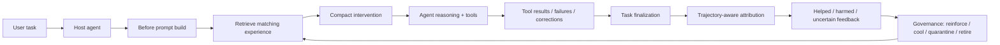

# ExperienceEngine

English | [简体中文](./README.zh-CN.md)

**A local experience-governance layer for coding agents.**

ExperienceEngine helps coding agents avoid repeating the same failed execution paths by turning prior task outcomes into short, governed prompt-boundary hints.

> Memory helps agents remember context.
> ExperienceEngine governs whether prior execution experience should intervene.

Supported hosts today: **Codex**, **Claude Code**, **OpenClaw**, and **Google Antigravity** through different hook / MCP / plugin paths.

---

## 10-Second Example

Without ExperienceEngine:

* A coding agent sees a SQLite startup failure.
* It spends several turns debugging connection pool settings.
* It eventually discovers the real issue: the DB connection was opened before the migration ran.
* Days later, in a similar repo or task, it repeats the same failed path.

With ExperienceEngine:

* The prior failure/fix/success path is distilled into a reusable experience node.
* When a similar task starts, ExperienceEngine may inject one compact hint:

```text
Run the migration before opening the DB connection.
```

* After the run, ExperienceEngine tracks whether that hint helped, harmed, or remained uncertain.
* If the hint keeps helping, it can become more trusted.
* If it starts harming similar tasks, it can cool down, be quarantined, or retire.

Core loop:

```text
task signals
→ distilled experience
→ hybrid retrieval
→ compact intervention
→ helped/harmed feedback
→ governance
```

---

## Why It Exists

Coding agents are already strong. They can handle large codebases, call tools, follow multi-step tasks, and often recover from mistakes.

But one failure mode still appears often:

> The agent eventually solves a problem, but later repeats the same failed execution path in a similar task.

This is not only a context-memory problem.
It is an execution-governance problem.

ExperienceEngine is designed to answer:

> When should prior execution experience actively guide or constrain a future coding task?

---

## Memory vs ExperienceEngine

| Layer            | Main job                                                                | Example                                           |
| ---------------- | ----------------------------------------------------------------------- | ------------------------------------------------- |
| Memory           | Remember facts, preferences, and context                                | “This repo uses pnpm.”                            |
| RAG              | Retrieve documents or previous content                                  | “Here is the migration doc.”                      |
| ExperienceEngine | Govern whether prior execution experience should affect future behavior | “Run migration before opening the DB connection.” |

ExperienceEngine is **not** meant to replace memory or RAG.

It is a separate layer focused on:

* repeated failure paths
* task outcomes
* prompt-boundary interventions
* helped/harmed feedback
* lifecycle governance for guidance

---

## What ExperienceEngine Does

ExperienceEngine can:

* capture real task signals from coding-agent runs
* distill repeated failure/fix/success paths into structured experience nodes
* retrieve matching experience before a task begins
* inject compact task-specific guidance instead of dumping long memory into the prompt
* track whether the agent appeared to follow or violate the injected guidance
* record helped/harmed/uncertain outcomes
* reinforce, cool, quarantine, or retire guidance over time
* keep repo/workspace experience scoped by default
* support cautious cross-scope reuse instead of blindly applying one repo’s lesson to another

---

## Architecture



ExperienceEngine works at the **context and host-integration layer**.
It does not modify the host model’s weights.

---

## Experience Node Model

ExperienceEngine does not store generic memories such as:

```text
The SQLite issue was related to migrations.
```

It tries to distill execution experience into structured nodes:

```text
Trigger pattern:
SQLite startup crash in this repo.

Compact hint:
Run the migration before opening the DB connection.

Recommended steps:
1. Run the migration.
2. Start the app again.
3. Only investigate the connection pool if startup still fails.

Avoid steps:
Do not start by tuning the connection pool.

Success signal:
Startup passes after the migration runs.

Evidence summary:
A previous task failed after connection-pool debugging, then succeeded after migration-first startup.
```

A node can include:

* trigger pattern
* compact hint
* goal
* recommended steps
* avoid steps
* fallback steps
* success signal
* stop / escalation conditions
* evidence summary
* origin records
* helped / harmed records
* lifecycle state
* delivery state
* portability evidence

---

## Lifecycle vs Delivery

ExperienceEngine separates **storage state** from **delivery behavior**.

Lifecycle state:

```text
candidate
→ priority_candidate
→ active
→ cooling
→ retired
```

Delivery state:

```text
shadow_only
conservative_only
eligible
quarantined
shadow_probe
retired
```

This separation matters because a node can exist in the store without being allowed to directly affect the agent.

Examples:

* A new candidate can stay `shadow_only`.
* A promising but unproven node can be `conservative_only`.
* A validated same-scope node can become `eligible`.
* Harmful guidance can become `quarantined`.
* Quarantined guidance can be cautiously tested through `shadow_probe`.
* Repeatedly harmful guidance can be retired.

---

## Helped / Harmed Feedback

ExperienceEngine does not assume a hint is good just because it was retrieved.

After a task, it can record whether an intervention:

* helped
* weakly helped
* was neutral
* stayed unknown
* weakly harmed
* strongly harmed

Trajectory-aware attribution compares injected expectations against observed tool events when available.

Examples of trajectory verdicts include:

```text
adoption_detected
non_adoption_detected
contra_adoption_detected
guidance_prevented_failure
guidance_caused_failure
trajectory_unknown
```

When trace evidence is incomplete, ExperienceEngine uses conservative fallback attribution from outcome signals, failure signatures, and harm detection.

Manual feedback is also available:

```bash
ee helped
ee harmed
```

Manual feedback is mainly for correcting the automatic judgment, not for grading every run.

---

## Host Support Matrix

| Host               | Install path                                                      | Routine interaction                    | Maturity                                                     |
| ------------------ | ----------------------------------------------------------------- | -------------------------------------- | ------------------------------------------------------------ |
| Codex              | `ee install codex`                                                | hooks + MCP                            | supported                                                    |
| Claude Code        | marketplace plugin, with `ee install claude-code` fallback        | MCP + plugin hooks                     | supported                                                    |
| OpenClaw           | native plugin install                                             | host-native plugin/runtime integration | most complete host-native path today                         |
| Google Antigravity | `ee install antigravity`, `ee agy exec -C <project>` for CLI runs | MCP + user-level plugin/hooks wiring   | supported through Agent Desktop / `agy` / observed IDE hooks |

Different hosts expose different hook surfaces, so the integration path and maturity are not identical.

---

## Quick Start

### 1. Install the CLI

```bash
npm install -g @alan512/experienceengine
```

Node.js `>=20` is required.

### 2. Choose your host

#### Codex

```bash
ee install codex
ee init
```

Then open a fresh Codex session in your repo.

If Codex asks you to review hooks, open:

```text
/hooks
```

Approve the ExperienceEngine hooks:

```text
UserPromptSubmit
PostToolUse
Stop
```

`PreToolUse` is not registered by default. It is only for synchronous gating experiments.

#### Claude Code

Preferred marketplace path:

```text
/plugin marketplace add https://github.com/Alan-512/ExperienceEngine.git
/plugin install experienceengine@experienceengine
```

Then run:

```bash
ee init
```

Fallback path:

```bash
ee install claude-code
ee init
```

Start a fresh Claude Code session so plugin hooks and MCP config are loaded.

#### OpenClaw

```bash
openclaw plugins install @alan512/experienceengine
openclaw gateway restart
ee init
```

OpenClaw currently has the deepest host-native plugin integration.

#### Google Antigravity

```bash
ee install antigravity
ee init
```

For CLI runs:

```bash
ee agy exec -C <project-path> "<prompt>"
```

Antigravity support covers Agent Desktop, the standalone `agy` CLI, and observed IDE hook/MCP surfaces where available.

---

## Shared Initialization

`ee init` configures shared ExperienceEngine state.

It can configure:

* distillation provider
* distillation model
* provider authentication
* embedding mode
* embedding provider
* shared secrets

Example:

```bash
ee init distillation --provider openai --model gpt-4.1-mini --auth-mode api_key
ee init secret OPENAI_API_KEY <your-api-key>
ee init embedding --mode api --api-provider openai --model text-embedding-3-small
ee init show
```

You can also configure Gemini or Jina for embeddings through the same `ee init embedding` flow.

---

## Data Location

By default, ExperienceEngine stores product state under:

```text
~/.experienceengine
```

That managed state can include:

* SQLite database
* product settings
* per-adapter install state
* optional local embedding model cache
* managed backups
* exports
* rollback snapshots

Model and embedding providers depend on configuration.
ExperienceEngine is local-first for product state, but not necessarily fully offline unless configured that way.

---

## Embedding Defaults

Current default behavior:

* `embeddingProvider = "api"`
* provider priority: OpenAI → Gemini → Jina
* if no API provider is available, ExperienceEngine falls back to legacy hash-based retrieval
* local semantic embeddings are optional and not installed by default

Useful environment variables:

```bash
EXPERIENCE_ENGINE_EMBEDDING_PROVIDER=local
EXPERIENCE_ENGINE_EMBEDDING_API_PROVIDER=openai|gemini|jina
```

To force local embeddings after installing the optional local runtime:

```bash
npm install -g @huggingface/transformers
```

---

## Routine Use

In normal use, stay inside your host agent first.

Ask questions like:

```text
What did ExperienceEngine just inject?
Why did that ExperienceEngine hint match?
Why didn't ExperienceEngine inject anything just now?
Mark the last ExperienceEngine intervention as helpful.
Mark the last ExperienceEngine intervention as harmful.
```

Use CLI fallback when you need explicit operator control:

```bash
ee status
ee doctor codex
ee doctor claude-code
ee doctor openclaw
ee doctor antigravity
ee inspect --last
ee helped
ee harmed
```

---

## Readiness and Value States

ExperienceEngine separates setup readiness from actual value.

Setup state:

```text
Installed
Initialized
Ready
```

Value state:

```text
Warming up
First value reached
```

A repo can be fully `Ready` while still `Warming up`.

`First value reached` should only be claimed after a real task shows visible value, such as:

* a repeated task avoids a previously known bad path
* a compact repo-relevant hint is injected
* the host can explain why the hint matched
* the task outcome updates future delivery
* `ee inspect --last` shows the recent intervention and node state

A generic warm-up message does not count as first value.

---

## What First Success Looks Like

After installation and initialization, a good first success looks like this:

1. You run a task similar to a previous failure/fix path.
2. ExperienceEngine injects a short relevant hint.
3. The host agent avoids the old failed path.
4. The task succeeds or produces useful evidence.
5. ExperienceEngine updates the node’s helped/harmed/uncertain state.
6. `ee inspect --last` explains what happened.

Example:

```bash
ee inspect --last --verbose
```


---

## Why Not Just Put This In AGENTS.md?

`AGENTS.md` is useful for stable, global project instructions.

ExperienceEngine is for guidance that may be:

* repo-local
* workflow-local
* task-family-specific
* still unproven
* possibly harmful outside its original context
* not ready to become a permanent rule

A good rule can eventually become documentation or a project convention.
ExperienceEngine is the governed proving ground before that.

---

## Safety Model

ExperienceEngine tries to avoid turning old experience into new prompt noise.

Key safeguards:

* compact interventions instead of long memory dumps
* same-scope experience is preferred
* cross-scope reuse is cautious
* destructive cross-repo guidance can be blocked
* dependency and major-version compatibility checks inform portability scoring
* harmful guidance can cool down, be quarantined, or retire
* uncertain nodes can stay shadow-only or conservative-only
* shadow-probe recovery allows quarantined guidance to be tested cautiously
* decisions are persisted so skipped turns can be inspected later

The product goal is **production-safe reuse**, not maximum recall.

---

## Retrieval

ExperienceEngine uses hybrid retrieval rather than semantic similarity alone.

The retrieval path can include:

* query rewriting
* lexical retrieval
* semantic retrieval
* rank fusion
* policy enrichment
* task-family matching
* scope matching
* failure-signature matching
* artifact / tech-stack matching
* reranking
* delivery-state gating

Semantic similarity is useful, but it is not treated as the only authority.

---

## Cross-Scope Portability

ExperienceEngine is workspace/repo-scoped by default.

Cross-scope reuse is intentionally cautious.

Portability checks can consider:

* same-scope vs cross-scope match
* primary language compatibility
* shared dependencies
* framework / ORM / runtime differences
* major-version mismatch penalties
* destructive guidance patterns
* historical harm
* successful reuse evidence under compatible fingerprints

Portability bands include:

```text
validated_portable
same_family
weakly_related
incompatible
```

Cross-scope guidance should earn trust through reuse evidence, not be blindly applied.

---

## Background Hygiene

ExperienceEngine includes background hygiene for experience quality.

It can help with:

* duplicate nodes
* conflicting guidance
* stale shadow-only nodes
* harmful live guidance
* risky delivery states
* conservative restoration after quarantine

High-impact actions are guarded.
Broad rewrites, unsafe deletes, and risky automatic changes are rejected or converted into safer operations.

For normal users, this should mostly stay in the background.

Inspection surfaces:

```bash
ee inspect review
ee inspect hygiene
ee inspect repo
```

Operator fallback:

```bash
ee maintenance governance drain
```

---

## CLI Reference

Common commands:

```bash
ee init
ee status
ee doctor <openclaw|claude-code|codex|antigravity>
ee inspect --last
ee inspect --trace <capsule-id>
ee helped
ee harmed
```

Host setup and repair:

```bash
ee install codex
ee install claude-code
ee install antigravity
ee repair codex
ee repair antigravity
```

OpenClaw uses host-native plugin installation:

```bash
openclaw plugins install @alan512/experienceengine
openclaw gateway restart
```

Backup and recovery:

```bash
ee backup
ee export
ee import <snapshot-path>
ee rollback <backup-id>
```

Advanced / operator commands:

```bash
ee maintenance embedding-smoke
ee maintenance governance drain
ee maintenance redistill-rule-nodes
ee maintenance merge-scope <sourceScopeId> <targetScopeId>
```

Most users should not need advanced maintenance commands during normal use.

---

## Advanced Host Notes

### Codex

Codex integration uses Codex-native hooks plus the shared ExperienceEngine MCP server.

Default hooks:

```text
UserPromptSubmit
PostToolUse
Stop
```

Notes:

* `UserPromptSubmit` owns prompt-time experience injection.
* `PostToolUse` and `Stop` are queued for background processing by default.
* `PreToolUse` is not registered by default.
* In mixed Windows Codex App + WSL Codex CLI setups, global hooks may be shared while MCP config is runtime-specific.
* `ee repair codex` can refresh global hooks and remove stale project-scoped MCP config.

Manual MCP fallback:

```bash
codex mcp add experienceengine --env EXPERIENCE_ENGINE_HOME=$HOME/.experienceengine -- npx -y @alan512/experienceengine codex-mcp-server
```

### Claude Code

Claude Code supports the bundled marketplace/plugin path:

```text
/plugin marketplace add https://github.com/Alan-512/ExperienceEngine.git
/plugin install experienceengine@experienceengine
```

Fallback:

```bash
ee install claude-code
```

Start a fresh Claude Code session after installation.

### OpenClaw

OpenClaw uses plugin/runtime integration rather than the generic adapter path.

```bash
openclaw plugins install @alan512/experienceengine
openclaw gateway restart
```

If OpenClaw reports only a global workspace, ExperienceEngine isolates that session rather than reusing unrelated global-workspace experience.

### Google Antigravity

Antigravity support includes:

* Agent Desktop user-level plugin/MCP wiring
* `agy` CLI integration
* observed IDE global hook/MCP surfaces where available

Install:

```bash
ee install antigravity
```

CLI run:

```bash
ee agy exec -C <project-path> "<prompt>"
```

Project-local fallback:

```bash
ee antigravity activate-project -C <project-path>
```

Antigravity behavior can vary by environment, so use:

```bash
ee doctor antigravity
```

to inspect the current installation and observed surfaces.

---

## Who It Is For

Use ExperienceEngine if:

* you use coding agents repeatedly in similar repos or workflows
* you see agents rediscovering the same fixes
* you want compact guidance instead of broad memory recall
* you care whether a reused hint actually helped or harmed
* you want stale or harmful guidance to cool down instead of accumulating forever

Do not use ExperienceEngine if:

* you only want personal note-taking memory
* you want generic document RAG
* you rarely repeat workflows
* you want everything remembered by default
* you expect model-weight training or permanent fine-tuning

---

## Project Status

Stable:

* core experience lifecycle
* prompt-boundary intervention flow
* inspect / helped / harmed loop
* local SQLite-backed product state
* host integrations
* CLI/operator fallback

Supported hosts:

* Codex
* Claude Code
* OpenClaw
* Google Antigravity

Evolving:

* retrieval tuning
* provider strategy
* advanced host UX
* cross-scope portability tuning
* richer trajectory attribution
* background hygiene behavior

The project is early. Feedback from heavy coding-agent users is especially useful.

---

## Documentation

Additional documentation:

* [Experience Model Overview](./docs/development/experience-model.md)
* [ExperienceEngine User Guide](./docs/user-guide.md)

Suggested future docs:

* `docs/hosts/codex.md`
* `docs/hosts/claude-code.md`
* `docs/hosts/openclaw.md`
* `docs/hosts/antigravity.md`
* `docs/governance.md`
* `docs/troubleshooting.md`

---

## License

MIT License.

See [LICENSE](./LICENSE).
