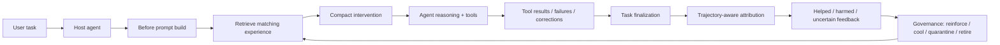

# ExperienceEngine

[English](./README.md) | 简体中文

**面向编程 Agent 的本地经验治理层。**

ExperienceEngine 通过将先前的任务结果转化为简短且受治理的提示词边界提示（prompt-boundary hints），帮助编程 Agent 避免重复犯相同的执行错误。

> Memory 帮助 Agent 记住上下文。
> ExperienceEngine 治理先前的执行经验是否应该介入。

当前支持的宿主：**Codex**、**Claude Code**、**OpenClaw** 和 **Google Antigravity**（通过不同的 hook / MCP / 插件路径）。

---

## 10 秒理解

没有 ExperienceEngine：

* 编程 Agent 遇到 SQLite 启动失败。
* 它花了好几轮去调试连接池设置。
* 最终它发现了真正的问题：在执行数据库迁移（migration）之前就打开了数据库连接。
* 几天后，在类似的仓库或任务中，它又重复了相同的失败路径。

有 ExperienceEngine：

* 先前的 失败-修复-成功 路径被提炼为一个可复用的经验节点。
* 当相似的任务开始时，ExperienceEngine 可能会注入一条精简的提示：

```text
Run the migration before opening the DB connection.
```

* 运行结束后，ExperienceEngine 会追踪该提示是帮到了（helped）、干扰了（harmed）还是保持不确定（uncertain）。
* 如果该提示持续有帮助，它的信任度会提升。
* 如果它开始对相似任务产生负面影响，它会被降温（cool down）、隔离（quarantine）或退役（retire）。

核心循环：

```text
task signals (任务信号)
→ distilled experience (提炼经验)
→ hybrid retrieval (混合检索)
→ compact intervention (精简介入)
→ helped/harmed feedback (帮到/伤害反馈)
→ governance (治理)
```

---

## 为什么要做这个

Coding Agent 已经非常强大。它们能够处理大型代码库、调用工具、执行多步任务，并通常能从错误中恢复。

但有一类失败模式仍然频繁出现：

> Agent 最终解决了问题，但稍后在相似的任务中又重复了相同的失败执行路径。

这不仅仅是上下文记忆（context-memory）问题。
这是一个**执行治理（execution-governance）**问题。

ExperienceEngine 旨在回答：

> 先前的执行经验何时应当主动引导或约束未来的编码任务？

---

## Memory vs ExperienceEngine

| 层级 | 主要工作 | 示例 |
| ---------------- | ----------------------------------------------------------------------- | ------------------------------------------------- |
| Memory           | 记住事实、偏好和上下文                                                                | “此仓库使用 pnpm。”                            |
| RAG              | 检索文档或以前的内容                                                                 | “这是 migration 文档。”                      |
| ExperienceEngine | 治理先前的执行经验是否应当影响未来的行为 | “在打开数据库连接之前先运行 migration。” |

ExperienceEngine **不是**为了替代 Memory 或 RAG。

它是一个独立的层，专注于：

* 重复的失败路径
* 任务结果
* 提示边界介入（prompt-boundary interventions）
* 帮到/伤害反馈（helped/harmed feedback）
* 对 guidance 的生命周期治理

---

## ExperienceEngine 的功能

ExperienceEngine 可以：

* 从 Coding Agent 的运行中捕获真实的任务信号
* 将重复的 失败-修复-成功 路径提炼为结构化的经验节点
* 在任务开始前检索匹配的经验
* 注入精简的、针对具体任务的 guidance，而不是将冗长的记忆全部塞进 prompt 中
* 追踪 Agent 是否遵循或违反了注入的 guidance
* 记录 帮到/伤害/不确定（helped/harmed/uncertain）的结果
* 随着时间的推移对 guidance 进行强化、降温、隔离或退役
* 默认将经验限制在仓库/工作空间范围内（repo/workspace scoped）
* 支持谨慎的跨范围（cross-scope）复用，而不是盲目地将一个仓库的教训应用到另一个仓库

---

## 架构



ExperienceEngine 工作在**上下文和宿主集成层**。
It does not modify the host model’s weights.

---

## 经验节点模型

ExperienceEngine 不存储泛化的记忆，例如：

```text
SQLite 问题与 migration 相关。
```

It tries to distill execution experience into structured nodes:

```text
触发模式：
此仓库中的 SQLite 启动崩溃。

精简提示：
Run the migration before opening the DB connection.

推荐步骤：
1. 运行 migration。
2. 重新启动应用。
3. 仅在启动仍然失败时才调查连接池。

避免步骤：
不要一上来就调试连接池设置。

成功信号：
在运行 migration 后启动成功。

证据总结：
先前的任务在进行连接池调试后失败，随后在 migration 优先启动后成功。
```

经验节点可以包含：

* 触发模式（trigger pattern）
* 精简提示（compact hint）
* 目标（goal）
* 推荐步骤（recommended steps）
* 避免步骤（avoid steps）
* 备用步骤（fallback steps）
* 成功信号（success signal）
* 终止/升级条件（stop / escalation conditions）
* 证据总结（evidence summary）
* 来源记录（origin records）
* 帮到/伤害记录（helped / harmed records）
* 生命周期状态（lifecycle state）
* 交付状态（delivery state）
* 可移植性证据（portability evidence）

---

## 生命周期 vs 交付状态

ExperienceEngine 将**存储状态**与**交付行为**分离开来。

生命周期状态（Lifecycle state）：

```text
candidate (候选)
→ priority_candidate (高优候选)
→ active (活跃)
→ cooling (降温)
→ retired (退役)
```

交付状态（Delivery state）：

```text
shadow_only (仅影子投放)
→ conservative_only (仅保守投放)
→ eligible (符合投放条件)
→ quarantined (已隔离)
→ shadow_probe (影子探测)
→ retired (已退役)
```

这种分离至关重要，因为一个节点可以存在于存储中，而不被允许直接影响 Agent。

例如：

* 一个新的候选节点可以保持 `shadow_only`。
* 一个有希望但未经验证的节点可以保持 `conservative_only`。
* 一个在相同范围内经过验证的节点可以变为 `eligible`。
* 有害的 guidance 可以变为 `quarantined`。
* 被隔离的 guidance 可以通过 `shadow_probe` 进行谨慎的测试。
* 反复有害的 guidance 可以被退役（retired）。

---

## 帮到 / 伤害反馈

ExperienceEngine 不会仅仅因为某个提示被检索出来，就假定它是好的。

在任务结束之后，它可以记录一次介入究竟是：

* 帮到了（helped）
* 弱帮到（weakly helped）
* 中性（neutral）
* 保持未知（stayed unknown）
* 弱伤害（weakly harmed）
* 强伤害（strongly harmed）

轨迹感知归因（Trajectory-aware attribution）会在可行时，将注入的预期与观察到的工具事件进行对比。

轨迹判决的例子包括：

```text
adoption_detected (检测到采纳)
non_adoption_detected (未检测到采纳)
contra_adoption_detected (检测到反向采纳)
guidance_prevented_failure (Guidance 阻止了失败)
guidance_caused_failure (Guidance 导致了失败)
trajectory_unknown (轨迹未知)
```

当轨迹证据不完整时，ExperienceEngine 会使用来自结果信号、失败特征和伤害检测的保守备用归因。

也可以进行手动反馈：

```bash
ee helped
ee harmed
```

手动反馈主要用于纠正自动判决，而不是用于对每次运行都进行人工打分。

---

## 宿主支持矩阵

| 宿主 | 安装路径 | 日常交互 | 成熟度 |
| ------------------ | ----------------------------------------------------------------- | -------------------------------------- | ------------------------------------------------------------ |
| Codex              | `ee install codex`                                                | hooks + MCP                            | 已支持                                                    |
| Claude Code        | 插件市场（marketplace）路径，保留 `ee install claude-code` 作为备用 | MCP + 插件 hooks                     | 已支持                                                    |
| OpenClaw           | 原生插件安装，或 `ee install openclaw` 回退路径          | 宿主原生交互 + package-local 运行时控制 | 精确 npm 与 ClawHub `0.5.1` artifact 已通过 published live-host 验证；完整支持声明仍受质量/基准发布证据门槛约束 |
| Google Antigravity | `ee install antigravity`，CLI 运行使用 `ee agy exec -C <project>` | MCP + 用户级插件/hooks 连线   | 通过 Agent Desktop / `agy` / 已观察到的 IDE hook 支持 |

不同的宿主暴露了不同的 hook 表面，因此集成路径和成熟度也有所不同。

---

## 快速开始

### 1. 安装 CLI

```bash
npm install -g @alan512/experienceengine
```

需要 Node.js `>=20`。

### 2. 选择你的宿主

#### Codex

```bash
ee install codex
ee init
```

然后，在你的仓库中开启一个新的 Codex 会话。

如果 Codex 要求你审查 hooks，请打开：

```text
/hooks
```

并批准 ExperienceEngine 的 hooks：

```text
UserPromptSubmit
PostToolUse
Stop
```

`PreToolUse` 默认不注册。它仅用于同步门控（gating）实验。

#### Claude Code

推荐的插件市场（marketplace）路径：

```text
/plugin marketplace add https://github.com/Alan-512/ExperienceEngine.git
/plugin install experienceengine@experienceengine
```

然后运行：

```bash
ee init
```

备用路径：

```bash
ee install claude-code
ee init
```

开启一个新的 Claude Code 会话，以便加载插件 hooks 和 MCP 配置。

#### OpenClaw

```bash
openclaw plugins install @alan512/experienceengine
openclaw gateway restart
ee init
```

`v0.5.x` 版本线已经包含 package-local supervisor/worker 运行时。但插件加载本身仍只证明日常交互：插件已加载时可以出现 `interaction_active = true`，而 `learning_runtime_active` 或 `production_learning_ready` 仍为 false。

使用 OpenClaw 中经过认证的命令检查状态，并在需要时初始化当前精确安装的 package generation：

```text
/experienceengine_status
/experienceengine_prepare_package_activation
```

prepare 命令是只读的。将其 `result` 字段返回的精确 JSON 对象复制到：

```text
/experienceengine_initialize_package_activation <exact-result-json>
```

然后使用 operator CLI 验证当前 authority：

```bash
ee verify openclaw-production
```

当前实现已在 WSL/Linux 和原生 Windows 通过 local-pack 真实宿主 preflight；精确发布的 npm `v0.5.0` 也已在 WSL 的 OpenClaw `2026.7.1` 通过完整真实宿主序列。已发布的 ClawHub `v0.5.0` 通过闭包检查，但其原生安装遗漏运行时依赖。尚未发布的 `v0.5.1` 候选通过干净、无链接的依赖 bundle 修复该渠道；在新发布物完成独立验收前，ClawHub 验收和完整质量门控支持声明仍未完成。

operator 回退路径为：

```bash
ee install openclaw
openclaw gateway restart
ee verify openclaw-production
```

如果 OpenClaw 要求安全扫描授权，请先查看命中项，再显式使用 `--approve-host-security-scan` 重试。ExperienceEngine 默认不会自动追加 unsafe-install 参数。

#### Google Antigravity

```bash
ee install antigravity
ee init
```

对于 CLI 运行：

```bash
ee agy exec -C <project-path> "<prompt>"
```

Antigravity 支持覆盖了 Agent Desktop、独立的 `agy` CLI，以及在有条件的情况下已观察到的 IDE 全局 hook/MCP 表面。

---

## 共享初始化

`ee init` 配置共享的 ExperienceEngine 状态。

它可以配置：

* 提炼（distillation）提供商
* 提炼模型
* 提供商认证方式
* 向量嵌入（embedding）模式
* 向量嵌入提供商
* 共享凭据（secrets）

示例：

```bash
ee init distillation --provider openai --model gpt-4.1-mini --auth-mode api_key
ee init secret OPENAI_API_KEY <your-api-key>
ee init embedding --mode api --api-provider openai --model text-embedding-3-small
ee init show
```

LLM fallback 配置分两层：

```bash
ee config set distillation.fallback_chain "gemini:gemini-2.5-flash,openai:gpt-4o-mini"
ee config set distillation.fallback_codes "429,500,502,503,504"
ee config set secret.EXPERIENCE_ENGINE_FALLBACK_MODELS "openai/gpt-4o-mini,deepseek/deepseek-chat"
```

`distillation.fallback_chain` 是 ExperienceEngine 跨 provider 的 fallback chain；`EXPERIENCE_ENGINE_FALLBACK_MODELS` 是 OpenRouter 单次请求里的 `models` 列表。前者用于主 provider 返回 fallbackable HTTP 状态后切换到另一个 provider，后者用于 OpenRouter 内部模型 fallback。

你也可以通过相同的 `ee init embedding` 流程配置 Gemini 或 Jina 进行向量嵌入。

---

## 数据目录

默认情况下，ExperienceEngine 将产品状态保存在：

```text
~/.experienceengine
```

该管理状态包括：

* SQLite 数据库
* 产品设置
* 每个适配器（adapter）的安装状态
* 可选的本地 embedding 模型缓存
* 受管备份
* 导出文件
* 回滚快照

模型和 embedding 提供商取决于配置。
ExperienceEngine 对产品状态是“本地优先”的，但除非专门配置，否则并不一定完全离线运行。

---

## Embedding 默认行为

当前默认行为：

* `embeddingProvider = "api"`
* 提供商优先级：OpenAI → Gemini → Jina
* 如果没有任何 API 提供商可用，ExperienceEngine 将回退到传统的基于哈希的检索（legacy hash-based retrieval）
* 本地语义 embedding 是可选增强，默认情况下不安装

常用的环境变量：

```bash
EXPERIENCE_ENGINE_EMBEDDING_PROVIDER=local
EXPERIENCE_ENGINE_EMBEDDING_API_PROVIDER=openai|gemini|jina
```

如果需要在安装了可选本地运行时后强制使用本地 embedding：

```bash
npm install -g @huggingface/transformers
```

---

## 日常使用

在日常使用中，优先停留在你的宿主 Agent 内部。

可以问以下问题：

```text
What did ExperienceEngine just inject? (ExperienceEngine 刚刚注入了什么？)
Why did that ExperienceEngine hint match? (为什么那条 ExperienceEngine 提示会命中？)
Why didn't ExperienceEngine inject anything just now? (为什么刚才 ExperienceEngine 没有注入任何内容？)
Mark the last ExperienceEngine intervention as helpful. (把刚才那次 ExperienceEngine 介入标记为 helpful。)
Mark the last ExperienceEngine intervention as harmful. (把刚才那次 ExperienceEngine 介入标记为 harmful。)
```

当需要显式的操作员控制时，使用 CLI 备用路径：

```bash
ee status
ee status --verbose
ee doctor codex
ee doctor claude-code
ee doctor openclaw
ee doctor antigravity
ee inspect --last
ee helped
ee harmed
```

`ee status` 是简洁的日常进度视图。需要宿主 wiring 细节、模型配置、原始检索计数、second-opinion 计数和 learning-quality 诊断时，再使用 `ee status --verbose`。

---

## 准备就绪状态与价值状态

ExperienceEngine 将安装就绪与实际产生的价值区分开来。

Setup 状态：

```text
Installed (已安装)
→ Initialized (已初始化)
→ Ready (就绪)
```

价值状态（Value state）：

```text
Warming up (正在热身)
→ First value reached (达到首次价值)
```

一个仓库可以处于完全 `Ready` 的状态，但仍处于 `Warming up`。

`First value reached` 应该仅在真实任务显示出可见价值后才被声明，例如：

* 重复的任务避开了先前已知的失败路径
* 注入了一条精简且与仓库高度相关的提示（hint）
* 宿主能够解释为什么该提示会命中
* 任务结果更新了未来的交付策略
* `ee inspect --last` 显示了最近的介入和节点状态

泛化的 onboarding 欢迎消息或热身提示不算作达到首次价值。

---

## 第一次成功是什么样子

在安装 and 初始化后，一次完美的首次成功表现如下：

1. 你运行了一个与先前 失败-修复 路径相似的任务。
2. ExperienceEngine 注入了一条精简且相关的 hint。
3. 宿主 Agent 避开了旧的失败路径。
4. 任务成功完成或产生了有用的证据。
5. ExperienceEngine 更新了节点的 helped/harmed/uncertain 状态。
6. `ee inspect --last` 能够解释刚才发生了什么。

例如：

```bash
ee inspect --last --verbose
```


---

## 为什么不直接写在 AGENTS.md 里？

`AGENTS.md` 适用于稳定、全局的项目级指令。

ExperienceEngine 则适用于可能具有以下特征的指导信息：

* 仅适用于本仓库/本地（repo-local）
* 仅适用于特定工作流（workflow-local）
* 针对特定任务族（task-family-specific）
* 仍未经验证
* 在原始上下文之外可能会产生负面影响
* 尚不适合成为永久规则

一条优秀的规则最终可以演变为文档或项目规范。
而 ExperienceEngine 是在此之前的**受治理验证场**。

---

## 安全模型

ExperienceEngine 尽力避免将旧的经验变成新的 prompt 噪声。

关键安全保障：

* 注入精简的介入提示，而不是倒灌冗长的记忆
* 优先使用相同范围（same-scope）的经验
* 跨范围（cross-scope）复用非常谨慎
* 可以拦截对跨仓库有破坏性的 guidance 模式
* 依赖项和主版本兼容性检查会用于计算可移植性评分
* 有害的 guidance 可以降温、被隔离或退役
* 不确定的节点保持 shadow-only 或 conservative-only
* shadow-probe 机制允许被隔离的 guidance 受到谨慎的测试
* 决策会被持久化，以便日后审计跳过的轮次

产品的目标是**生产安全的复用**，而不是最大化召回。

---

## 检索

ExperienceEngine 使用混合检索（hybrid retrieval）而不仅仅是语义相似度。

检索路径可以包含：

* 查询重写（query rewriting）
* 词法检索（lexical retrieval）
* 语义检索（semantic retrieval）
* 排序融合（rank fusion）
* 策略富集（policy enrichment）
* 任务族匹配（task-family matching）
* 范围匹配（scope matching）
* 失败特征匹配（failure-signature matching）
* 产物/技术栈匹配
* 重排序（reranking）
* 交付状态门控（delivery-state gating）

语义相似度非常有用，但它不被视为唯一的权威。

---

## 跨范围可移植性

ExperienceEngine 默认被限定在工作空间/仓库范围内。

跨范围（cross-scope）的复用是非常谨慎的。

可移植性检查会考量：

* 相同范围 vs 跨范围匹配
* 主要语言兼容性
* 共享依赖项
* 框架 / ORM / 运行时差异
* 主版本冲突惩罚
* 破坏性 guidance 模式
* 历史伤害记录
* 兼容指纹下的成功复用证据

可移植性分级包括：

```text
validated_portable (已验证可移植)
same_family (同族)
weakly_related (弱相关)
incompatible (不兼容)
```

跨范围的 guidance 应当通过复用证据赢得信任，而不是被盲目应用。

---

## 后台卫生治理

ExperienceEngine 包含用于保证经验质量的后台卫生治理（background hygiene）。

它可以自动协助处理：

* 重复节点
* 冲突的 guidance
* 过时的 shadow-only 节点
* 有害的活跃（live）guidance
* 高风险的交付状态
* 隔离后的保守恢复

高影响的动作会受到保护门控（guarded）。
大范围的改写、不安全的删除和高风险的自动变更都会被拒绝，或转化为更安全的折中操作。

对于普通用户来说，这几乎完全停留在后台运行。

检查命令：

```bash
ee inspect review
ee inspect hygiene
ee inspect repo
```

操作员应急后退路径：

```bash
ee maintenance governance drain
```

---

## CLI 命令参考

常用命令：

```bash
ee init
ee status
ee doctor <openclaw|claude-code|codex|antigravity>
ee inspect --last
ee inspect --trace <capsule-id>
ee helped
ee harmed
```

宿主设置与修复：

```bash
ee install codex
ee install claude-code
ee install antigravity
ee repair codex
ee repair antigravity
```

OpenClaw 的宿主原生日常交互安装方式：

```bash
openclaw plugins install @alan512/experienceengine
openclaw gateway restart
```

operator 管理的回退路径和严格运行时验证：

```bash
ee install openclaw
ee verify openclaw-production
```

备份与恢复：

```bash
ee backup
ee export
ee import <snapshot-path>
ee rollback <backup-id>
```

高级 / 运维命令：

```bash
ee maintenance embedding-smoke
ee maintenance governance drain
ee maintenance redistill-rule-nodes
ee maintenance merge-scope <sourceScopeId> <targetScopeId>
```

绝大多数用户在日常使用中不需要使用高级维护命令。

---

## 高级宿主说明

### Codex

Codex 集成使用了 Codex 原生 hooks 和共享的 ExperienceEngine MCP 服务。

默认 hooks：

```text
UserPromptSubmit
PostToolUse
Stop
```

说明：

* `UserPromptSubmit` 负责在构建提示词（prompt-time）时注入经验。
* `PostToolUse` 和 `Stop` 默认排队并在后台异步处理。
* `PreToolUse` 默认不注册。
* 在 Windows Codex App 与 WSL Codex CLI 共用同一仓库的混合设置中，全局 hooks 可以共享，而 MCP 配置则归每个运行时的 Codex home 自行管理。
* `ee repair codex` 可以刷新全局 hooks 并移除过期的项目级 MCP 配置。

手动 MCP 备用配置：

```bash
codex mcp add experienceengine --env EXPERIENCE_ENGINE_HOME=$HOME/.experienceengine -- npx -y @alan512/experienceengine codex-mcp-server
```

### Claude Code

Claude Code 支持内置的 marketplace/plugin 路径：

```text
/plugin marketplace add https://github.com/Alan-512/ExperienceEngine.git
/plugin install experienceengine@experienceengine
```

备用安装：

```bash
ee install claude-code
```

安装后，请开启一个新的 Claude Code 会话。

### OpenClaw

OpenClaw 提供宿主原生插件交互和 package-local supervisor/worker 运行时。该运行时已经通过 local-pack 真实宿主 preflight 和精确 npm 发布物验证，包括 Gateway 重启、fenced queue 完成、旧 authority 输出拒绝和优雅停机。ClawHub 发布物仍因安装后缺少运行时依赖而未通过，完整支持声明仍受质量发布门槛约束。

```bash
openclaw plugins install @alan512/experienceengine
openclaw gateway restart
```

下面三个状态必须分开理解：

```text
interaction_active
learning_runtime_active
production_learning_ready
```

插件加载或日常交互成功只满足第一层。`ee verify openclaw-production` 是严格的非零自动化 gate；`ee status` 仍是信息型命令。

对于冷启动的 package generation，使用经过认证的宿主原生控制序列：

```text
/experienceengine_status
/experienceengine_prepare_package_activation
/experienceengine_initialize_package_activation <exact-result-json>
```

`prepare_package_activation` 是只读操作，会返回初始化命令所需的当前 package generation、projection revision、launch revision、control request id 和 authorization id。缺失或修改这些必需的 identity、revision 或 idempotency 字段都会被拒绝；不要复用已经过期的 payload。

`artifact_runtime_validated` 也不同于 `support_claim_allowed`：某个精确发布物可以证明运行时可执行，但渠道、平台或质量发布门槛仍未完成。

如果 OpenClaw 仅上报了全局工作空间，ExperienceEngine 将会隔离该会话，而不是错误地复用不相关的全局工作空间经验。

### Google Antigravity

Antigravity 支持包括：

* Agent Desktop 用户级插件/MCP 配置
* `agy` CLI 集成
* 在有条件的情况下，已观察到的 IDE 全局 hook/MCP 表面

安装：

```bash
ee install antigravity
```

CLI 运行：

```bash
ee agy exec -C <project-path> "<prompt>"
```

项目级本地备用路径：

```bash
ee antigravity activate-project -C <project-path>
```

Antigravity 行为可能因具体环境而异，可以使用：

```bash
ee doctor antigravity
```

来检查当前的安装状态以及检测到的表面。

---

## 适合谁用

在以下情况下，推荐使用 ExperienceEngine：

* 你在相似的仓库或工作流中重复使用 Coding Agent
* 你亲眼见到 Agent 翻来覆去地重新踩坑、重新摸索出相同的修复方案
* 你希望获得精简且专注的约束性指导，而不是杂乱的通用记忆召回
* 你非常关心复用的提示词是否真的起到了好作用还是起到了反作用
* 你希望陈旧或有害的 guidance 能够自动降温，编制隔离，而不是堆积如山

在以下情况下，**不**推荐使用 ExperienceEngine：

* 你只需要一个记录个人笔记的 Memory
* 你需要通用的文档 RAG 检索
* 你的工作流极少重复
* 你希望默认记住所有经历的事情
* 你期望对模型权重进行微调（fine-tuning）

---

## 项目状态

稳定（Stable）：

* 核心经验生命周期（experience lifecycle）
* 提示边界介入流程（prompt-boundary intervention flow）
* inspect / helped / harmed 反馈循环
* 本地 SQLite 支持的产品状态存储
* 宿主集成
* CLI / 运维 fallback

已支持的宿主：

* Codex
* Claude Code
* OpenClaw
* Google Antigravity

持续演进中（Evolving）：

* 检索策略调优
* 提供商（provider）策略
* 高级宿主 UX
* 跨范围可移植性（cross-scope portability）调优
* 更加丰富的轨迹归因
* 后台卫生治理行为

本项目目前处于早期阶段。非常欢迎高频使用 Coding Agent 的重度用户向我们提供反馈！

---

## 补充文档

其他相关文档：

* [经验节点模型概述](./docs/development/experience-model.md)
* [ExperienceEngine 用户手册](./docs/user-guide.md)

建议的未来文档：

* `docs/hosts/codex.md`
* `docs/hosts/claude-code.md`
* `docs/hosts/openclaw.md`
* `docs/hosts/antigravity.md`
* `docs/governance.md`
* `docs/troubleshooting.md`

---

## 许可证

本项目采用 MIT 许可证。
详细内容请参阅 [LICENSE](./LICENSE)。
