# ExperienceEngine 当前项目架构蓝图

> 文档性质：当前架构蓝图  
> 文档目的：说明 ExperienceEngine 现有代码架构、核心数据模型、模块关系和运行流程。  
> 不包含内容：本文件不写架构优化建议、不写未来改造方向、不评价当前设计优劣。  
> 适用场景：后续如果要优化 ExperienceEngine，可以先读这份蓝图，理解现有系统如何组成、模块之间如何连接、数据如何流动。
> 维护规则：任何架构修改、模块边界调整、核心流程变化或宿主行为变化，都必须同步更新本蓝图，使它始终描述当前真实架构。

---

## 1. 项目当前定位

ExperienceEngine 当前定位为：

```text
面向 coding agent 的 execution experience governance layer。
```

它处理的核心对象不是普通记忆，而是：

```text
从真实 coding task 中沉淀出来的、可以在未来相似任务中复用的 execution guidance。
```

当前 README 中的主流程可以概括为：

```text
task signals -> distilled experience -> retrieval -> short intervention -> feedback -> governance
```

在代码层面，这条流程对应为：

```text
Host task
  -> Host adapter
  -> Runtime input
  -> Task signal / Tool event
  -> Experience input record
  -> Candidate / Node
  -> Retrieval / Intervention
  -> Injection event
  -> Attribution / Review
  -> Node lifecycle update
```

---

## 2. 当前顶层模块结构

当前代码可以按照职责分为以下模块层：

```text
src/
  adapters/              # 不同宿主的接入层，例如 Codex
  analyzer/              # 任务信号分析、候选生成前的判断与归纳
  cli/                   # ee CLI 命令入口与命令分发
  config/                # 配置 schema、配置加载、路径解析
  controller/            # 检索、排序、注入决策、注入渲染
  distillation/          # candidate 到 node 的蒸馏与 provider 接入
  experience-management/ # 节点生命周期、repo policy、任务管理信号
  feedback/              # helped / harmed 反馈、归因、状态转换
  hybrid/                # hybrid review / postmortem 相关路径
  input/                 # HostPromptContext / ToolEvent 到 ExperienceInput 的转换
  install/               # host 安装、升级、修复相关逻辑
  interaction/           # inspect、feedback、operator read surface
  maintenance/           # hygiene、export drafts、维护任务
  mcp/                   # MCP 或 MCP 相关入口
  plugin/                # runtime capture、hooks、host payload 辅助
  runtime/               # 核心运行时服务
  store/                 # SQLite / vector store / repositories
  types/                 # 领域类型定义
  utils/                 # 通用工具函数
  version/               # 版本与远端 release 检查
```

Interaction surfaces are presented with a tier model:

- `routine`: host-first review and feedback, status, doctor, last-inspection, and helped/harmed fallback
- `operator`: install, upgrade, repair, operator review, hygiene review, export drafts, and managed state workflows
- `advanced`: maintenance commands, raw evaluations, broker internals, and developer diagnostics

Tier is separate from mutation risk. Operator review, hygiene, and export drafts are read-only operator workflows; install/upgrade/import/rollback are operator workflows with high-impact safeguards.

### Autonomous Hygiene Governance

Autonomous hygiene governance is a separate maintenance path from read-only hygiene inspection. Hygiene reports and operator review remain inspection surfaces; mutation happens only through the governance scheduler, planner, validator, applicator, and SQLite audit records. The approval service remains available for legacy queued approval records, but new autonomous experience-store governance uses guarded automatic execution.

Runtime hooks use host lifecycle events as wake signals, not as the source of truth for cadence:

```text
host startup / prompt lookup / posttask / stop
  -> maybeEnqueueGovernance(scope)
  -> persisted schedule + backoff + finding hash
  -> per-scope lease
  -> bounded drain
  -> planner
  -> deterministic validator
  -> safe or guarded apply
  -> action audit + rollback snapshot
```

The scheduler key is the canonical scope id. Host instance identity is only lease owner metadata, so frequent host open/close cycles and multiple supported hosts sharing the same ExperienceEngine home do not multiply governance frequency.

Core modules:

- `src/maintenance/hygiene-governance-scheduler.ts`: due checks, leases, bounded drain, backoff, keeper-compatible entrypoint
- `src/maintenance/hygiene-governance-planner.ts`: bounded input package, LLM strict JSON plan, deterministic fallback
- `src/maintenance/hygiene-governance-validator.ts`: deterministic safety checks for merge, retire, downgrade, quarantine, rewrite, scope, evidence, guarded high-impact experience-store execution, and non-store action rejection
- `src/maintenance/hygiene-governance-applicator.ts`: safe and guarded automatic application with snapshot/audit references
- `src/maintenance/hygiene-governance-approvals.ts`: legacy confirmation-token planning, approval execution/rejection, affected-row stale checks
- `src/store/sqlite/repositories/hygiene-governance-repo.ts`: schedule, lease, run, plan, action, approval, snapshot, and rollback persistence

High-impact experience-store actions are guarded automatic mutations, never direct LLM mutations: promotion lands in conservative delivery, delete-like cleanup is soft-retire/quarantine, and conflicted merges keep the canonical node out of direct live eligibility. Legacy approval tokens still bind scope, plan, action, affected row hashes, diff summary, and expiration for older queued approval records.

---

## 3. 当前整体架构图

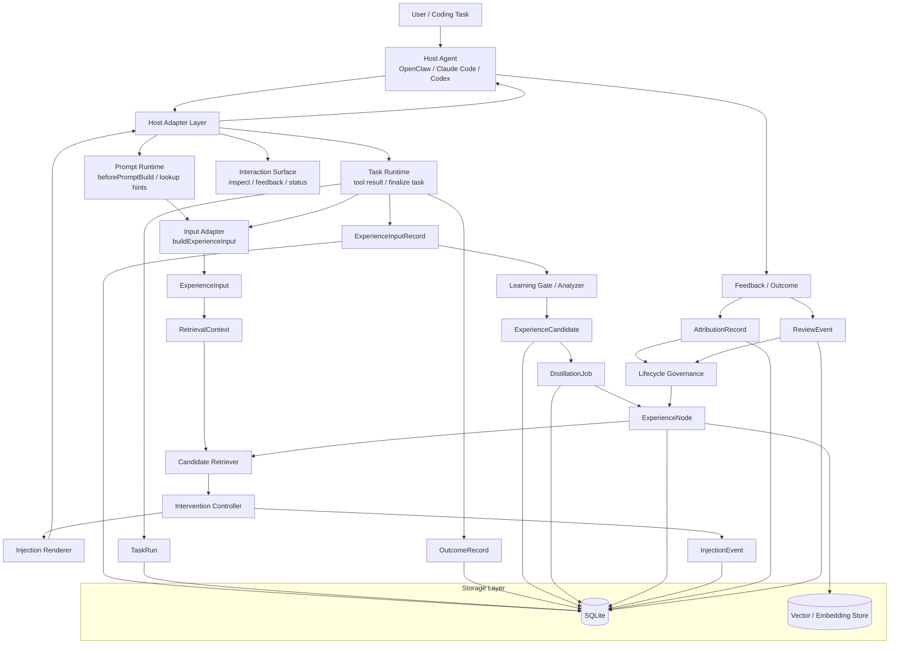

---

## 4. Host Adapter Layer

### 4.1 模块位置

当前与宿主接入相关的代码主要分布在：

```text
src/adapters/
src/plugin/
src/cli/commands/*hook*.ts
src/cli/commands/mcp-server.ts
```

Codex MCP server 入口位于：

```text
src/adapters/codex/mcp-server.ts
```

### 4.2 当前支持的宿主

```text
OpenClaw
Claude Code
Codex
```

### 4.3 Adapter 层输入输出

Adapter 层接收宿主侧事件，并将其转换为 ExperienceEngine 内部结构。

常见输入包括：

```text
cwd
sessionId
user prompt
tool result
task finalization signal
feedback request
inspect request
```

转换后的核心内部对象包括：

```text
HostPromptContext
ToolEvent
CodexLookupArgs
CodexToolResultArgs
CodexFinalizeArgs
```

### 4.4 Codex MCP 暴露的核心工具

```text
experienceengine_lookup_hints
experienceengine_record_tool_result
experienceengine_finalize_task
experienceengine_feedback_last
experienceengine_explain_last_decision
experienceengine_get_capabilities
experienceengine_doctor
```

这些工具连接到：

```text
ExperiencePromptRuntimeService
ExperienceRuntimeService
ExperienceInteractionService
ExperienceOperationalService
```

---

## 5. Runtime Layer

Runtime 层是当前主流程的核心。

主要文件：

```text
src/runtime/prompt-service.ts
src/runtime/service.ts
```

### 5.1 ExperiencePromptRuntimeService

文件：

```text
src/runtime/prompt-service.ts
```

主要入口：

```text
beforePromptBuild(context: HostPromptContext)
```

当前职责：

```text
1. 维护 prompt-time session state
2. 合并 HostPromptContext
3. 构造 ExperienceInput
4. 构造 RetrievalContext
5. 根据 scope 查询可用 ExperienceNode
6. 读取 ScopeTaskStats
7. 读取或创建 RepoPolicy
8. 调用 decideIntervention
9. 计算 live / shadow / holdout delivery mode
10. 写入 InjectionEvent
11. 返回 text / notice / scorecard / injected_node_ids
```

### 5.2 beforePromptBuild 当前流程图

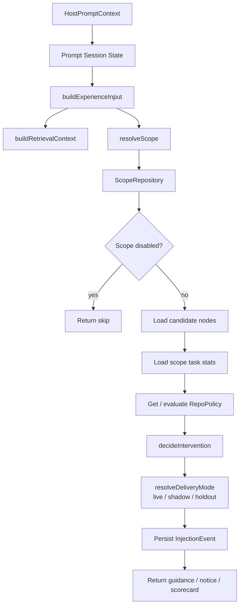

### 5.3 ExperienceRuntimeService

文件：

```text
src/runtime/service.ts
```

当前主要入口包括：

```text
recoverToolEvents(sessionId, payload)
persistToolResult(...)
finalizeTask(...)
waitForBackgroundLearning()
```

当前职责覆盖：

```text
1. 维护 runtime session state
2. 工具事件去重与追加
3. 从 host payload 中恢复工具结果
4. 构造 finalized ExperienceInput
5. 写入 ExperienceInputRecord
6. 写入 TaskRun
7. 写入 OutcomeRecord
8. 更新 ScopeTaskStats
9. 加载 LlmLearningGate
10. 加载 DistillationQueueWorker
11. 创建 ExperienceCandidate
12. 创建 DistillationJob
13. 处理 background learning task
14. 处理 hybrid postmortem artifact
15. 应用 postmortem node review
16. 写入 ReviewEvent
17. 更新 ExperienceNode
18. 维护 RuntimeCaptureWriter
```

### 5.4 Runtime session state

当前 runtime session state 包括：

```text
context?: HostPromptContext
episodeId?: string
toolEvents: ToolEvent[]
toolEventKeys: Set<string>
injectedNodeIds: string[]
lastInjectionEvent?: InjectionEvent
```

---

## 6. Input / Signal Layer

该层负责把宿主上下文转换成 ExperienceEngine 领域输入。

主要文件：

```text
src/input/input-adapter.ts
src/input/tasktype-resolver.ts
src/input/outcome-resolver.ts
src/input/scope-resolver.ts
src/input/context-summary-adapter.ts
src/input/tool-event-significance.ts
src/analyzer/candidate-signals.ts
```

### 6.1 ExperienceInput

结构：

```text
ExperienceInput {
  scope_id
  task_type
  task_summary
  tool_events
  outcome_signal
  context_summary
  injected_node_ids
}
```

来源：

```text
HostPromptContext + ToolEvent[]
```

构造函数：

```text
buildExperienceInput(context, toolEvents)
```

### 6.2 ToolEvent

结构：

```text
ToolEvent {
  event_id
  tool_name
  input_summary?
  output_summary?
  status
  exit_code?
  error_signature?
  started_at
  ended_at?
}
```

### 6.3 CandidateSourceSignal

由 analyzer 层从 ExperienceInput 中构造，字段包括：

```text
task_summary
context_summary
outcome_signal
tool_events
evidence
failure_signature
retry_count
correction_signals
directional_correction
evidence_driven_reversal
tool_event_summary
```

相关生成逻辑：

```text
src/analyzer/candidate-signals.ts
```

---

## 7. Learning Layer

Learning Layer 负责从 finalized task 中生成 candidate，并通过 distillation 形成 node。

主要文件：

```text
src/analyzer/llm-learning-gate.ts
src/analyzer/candidate-signals.ts
src/analyzer/experience-analyzer.ts
src/analyzer/node-deduper.ts
src/analyzer/node-normalizer.ts
src/distillation/queue-worker.ts
src/distillation/*
```

### 7.1 Learning 数据流

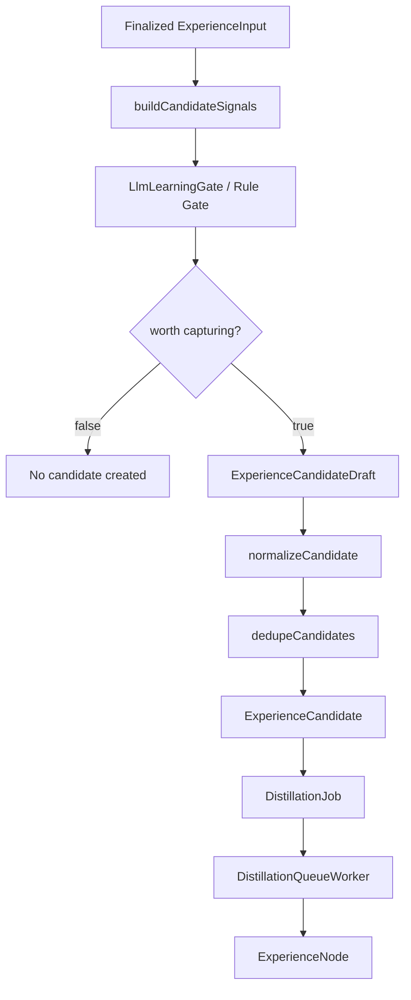

### 7.2 ExperienceCandidate

结构来自：

```text
ExperienceCandidateDraft + runtime source metadata
```

主要字段包括：

```text
id
task_run_id
candidate_kind
source_record_id
source_context_summary
source_outcome_signal
raw_summary
failure_signature
source_signal
lifecycle_state
retry_count
distilled_node_id
last_error
created_at
updated_at
distilled_at
discarded_at
last_failed_at
```

候选生命周期：

```text
pending
distilled
failed
discarded
```

### 7.3 DistillationJob

主要字段：

```text
id
candidate_id
status
extractor_profile
distillation_source
failure_bucket
retry_count
last_error
created_at
updated_at
started_at
finished_at
discarded_at
```

Job 状态：

```text
pending
processing
succeeded
failed
discarded
```

---

## 8. Experience Node Layer

ExperienceNode 是当前系统中被检索、注入和治理的核心经验单元。

定义位置：

```text
src/types/domain.ts
```

存储表：

```text
experience_nodes
```

### 8.1 ExperienceNode 结构

#### 身份与分类

```text
id
node_type
scope_id
task_type
experience_kind
source_kind
```

#### 匹配与适用条件

```text
trigger_pattern
applicability_notes
env_signature
retrieval_text
embedding
embedding_provider
embedding_model
embedding_version
embedding_dimensions
```

#### 注入内容

```text
compact_hint
goal
recommended_steps
avoid_steps
fallback_steps
success_signal
stop_condition
escalation_condition
evidence_summary
```

#### correction / expectation correction 字段

```text
confidence_signal
validation_state
correction_scope
correction_category
deviation_pattern
corrected_constraint
```

#### distillation / merge 信息

```text
distillation_mode_used
distillation_source
redistilled_from
promotion_signal
promotion_reason
merge_decision
merge_reason
priority_promotion_applied
```

#### 治理状态

```text
state
delivery_state
usage_count
helped_count
harmed_count
consecutive_harmed_count
last_feedback_verdict
support_count
last_used_at
last_helped_at
last_harmed_at
quarantined_at
quarantine_reason
```

#### 来源记录

```text
origin_record_ids
helped_record_ids
harmed_record_ids
```

### 8.2 Node state

当前状态类型：

```text
candidate
priority_candidate
active
cooling
retired
```

### 8.3 Delivery state

当前投放状态类型：

```text
shadow_only
conservative_only
eligible
quarantined
```

### 8.4 Node 与其他对象关系

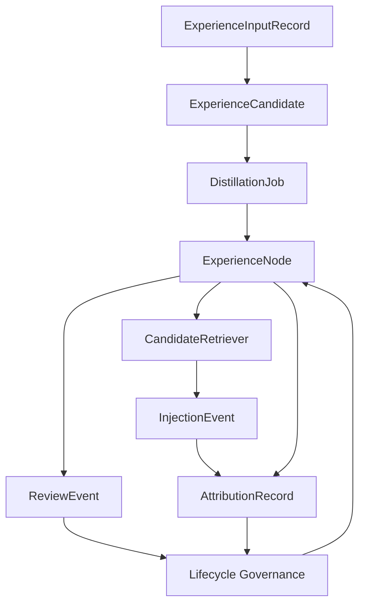

---

## 9. Retrieval / Intervention Layer

该层负责查找节点、评分、排序、决策和渲染注入内容。

主要文件：

```text
src/controller/retrieval-context.ts
src/controller/candidate-retriever.ts
src/controller/lexical-retriever.ts
src/controller/policy-enricher.ts
src/controller/model-reranker.ts
src/controller/model-reranker-mode.ts
src/controller/node-ranker.ts
src/controller/trigger-evaluator.ts
src/controller/intervention-controller.ts
src/controller/injection-renderer.ts
src/controller/injection-scorecard.ts
src/controller/inline-notice.ts
```

### 9.1 RetrievalContext

字段：

```text
scopeId
host
taskType
taskSummary
contextSummary
toolNames
failureSignature
outcomeSignal
injectedNodeIds
isReadOnly
modulePaths
expectationCorrectionIntent
```

### 9.2 CandidateRetriever 当前流程

```mermaid
flowchart TD
  Input[ExperienceInput] --> Query[buildRetrievalQuery]
  Query --> HardFilter[hardFilterNodes]
  HardFilter --> Lexical[computeLexicalRetrievalScores]
  Lexical --> Shortlist[Lexical Shortlist]
  Shortlist --> SemanticMode{semantic mode}
  SemanticMode -->|skipped| Policy
  SemanticMode -->|rerank| SemanticRerank[Semantic Rerank]
  SemanticMode -->|backfill| SemanticBackfill[Semantic Backfill]
  SemanticRerank --> Fusion[Score Fusion]
  SemanticBackfill --> Fusion
  Fusion --> Policy[Policy Enrichment]
  Policy --> MatchScorecard[buildMatchScorecard]
  MatchScorecard --> Rerank[Heuristic / Model Rerank]
  Rerank --> Ranked[RetrievedCandidate[]]
```

### 9.3 RetrievedCandidate

当前候选检索结果包含：

```text
node
semanticScore
lexicalScore
fusedScore
retrievalScore
retrievalReasons
policyAdjustment
policyScore
policyReasons
policyComponents
rerankScore
rerankSource
familyScore
matchScorecard
totalScore
scopeMatch
taskFamilyMatch
scoreMargin
```

### 9.4 InterventionController

主要文件：

```text
src/controller/intervention-controller.ts
```

输入：

```text
ExperienceInput
ExperienceNode[]
ScopeTaskStats
triggerThreshold
maxHints
ExperienceEngineConfig
RetrievalContext
RepoPolicy
```

输出：

```text
InterventionDecision {
  mode
  selected
  text
  diagnostics
}
```

mode 类型：

```text
skip
inject_conservative
inject
```

---

## 10. Injection Event / Scorecard Layer

### 10.1 InjectionEvent

存储表：

```text
injection_events
```

字段：

```text
injection_id
episode_id
session_id
scope_id
task_type
task_summary
mode
delivery_mode
delivered
injected_node_ids
injection_count
scorecard
was_successful
harm_observed
attribution_reason
created_at
resolved_at
```

### 10.2 InjectionScorecard

Scorecard 中包含：

```text
sessionId
scopeId
taskType
taskSummary
mode
interventionStrength
riskLevel
recommendation
reasons
topCandidates
topCandidateScore
scoreMargin
fastPathApplied
queryRewriteApplied
mergeDecision
promotionSignal
gateReason
decisionReason
confidence
budgetClass
secondOpinionApplied
selectedCandidateIds
recordOnlyDiagnosticCandidateIds
rejectedCandidates
nodes
createdAt
```

### 10.3 Scorecard 关系图

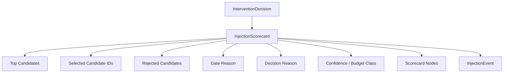

---

## 11. Feedback / Attribution / Governance Layer

该层负责记录注入后的效果，并更新 ExperienceNode 状态。

主要文件：

```text
src/feedback/feedback-manager.ts
src/feedback/automatic-attribution.ts
src/feedback/harm-detector.ts
src/feedback/state-transition.ts
src/feedback/stats-updater.ts
src/experience-management/node-lifecycle-governance.ts
src/experience-management/repo-policy.ts
```

### 11.1 ReviewEvent

存储表：

```text
review_events
```

event_type 包括：

```text
mark_helped
mark_harmed
mark_uncertain
cool
retire
quarantine
restore_conservative
restore_eligible
promote_eligible
```

source：

```text
automatic
user
```

### 11.2 AttributionRecord

存储表：

```text
attribution_records
```

主要字段：

```text
id
injection_id
node_id
episode_id
intervention_strength
injection_mode
delivery_mode
delivered
outcome
attribution_verdict
confidence
evidence_refs
user_override
source
attribution_reason
created_at
resolved_at
```

AttributionVerdict 类型：

```text
strong_helped
weak_helped
neutral
unknown
weak_harmed
strong_harmed
```

### 11.3 Node lifecycle governance

主要文件：

```text
src/experience-management/node-lifecycle-governance.ts
src/feedback/state-transition.ts
```

治理会更新：

```text
state
delivery_state
helped_count
harmed_count
consecutive_harmed_count
last_feedback_verdict
last_helped_at
last_harmed_at
quarantined_at
quarantine_reason
```

---

## 12. Storage Layer

当前主要持久化使用 SQLite。

Schema 文件：

```text
src/store/sqlite/schema.sql
```

Repository 文件位于：

```text
src/store/sqlite/repositories/
```

Vector / embedding 相关代码位于：

```text
src/store/vector/
```

### 12.1 SQLite 表清单

```text
scopes
experience_input_records
task_runs
outcome_records
review_events
hybrid_review_artifacts
hybrid_invocation_traces
experience_nodes
experience_candidates
distillation_jobs
injection_events
attribution_records
repo_policies
scope_task_stats
```

### 12.2 表关系图

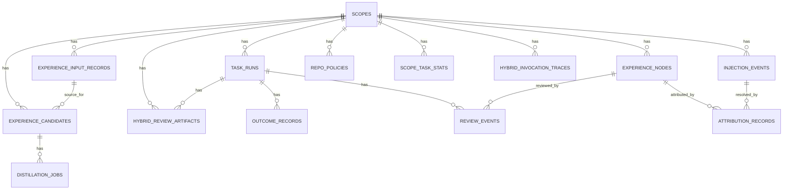

---

## 13. Interaction / Operator Layer

该层用于查看状态、解释决策、反馈上一条注入、查看 review / hygiene / export drafts 等。

主要文件：

```text
src/interaction/service.ts
src/interaction/operational-service.ts
src/interaction/operational-actions-service.ts
src/interaction/state-artifact-service.ts
src/adapters/codex/mcp-server.ts
src/cli/dispatch.ts
src/cli/commands/*
```

### 13.1 InteractionService 常见能力

Codex MCP surface 中使用了这些交互能力：

```text
inspectLast
inspectRecent
listActiveNodes
inspectNode
listNodesByState
listNodesByType
inspectLearningSummary
inspectRepoSummary
inspectReview
inspectHygiene
inspectExportDrafts
explainLastDecision
feedbackLast
feedbackNode
disableScope
enableScope
coolNode
retireNode
```

### 13.2 CLI command dispatch

CLI 入口：

```text
src/cli/index.ts
src/cli/dispatch.ts
```

命令分发包括：

```text
install
backup
claude-hook
codex-hook
codex
codex-mcp-server
mcp-server
doctor
evaluate
config
models
init
repair
status
export
import
rollback
upgrade
stats
feedback
helped
harmed
inspect
maintenance
disable
enable
cool
retire
```

---

## 14. Hybrid Layer

Hybrid 相关结构在当前代码中独立存在。

主要涉及：

```text
src/hybrid/
hybrid_review_artifacts
hybrid_invocation_traces
HybridWorkerClient
HybridReviewArtifactRepository
HybridInvocationTraceRepository
```

当前 runtime 中会处理：

```text
hybrid rollout
async postmortem
hybrid review artifact
postmortem node review
delivery recommendation
```

相关配置项位于：

```text
src/config/config-schema.ts
```

包括：

```text
hybridEnabled
hybridSyncExplainEnabled
hybridAsyncPostmortemEnabled
hybridRolloutMode
hybridCanaryRate
hybridKillSwitch
hybridRoutePolicyVersion
hybridCapsuleSchemaVersion
hybridExplainDecisionProfileVersion
hybridPostmortemReviewProfileVersion
hybridExplainLlmEnabled
hybridAsyncPostmortemLlmEnabled
```

---

## 15. 当前主流程时序图

### 15.1 Task start / lookup hints

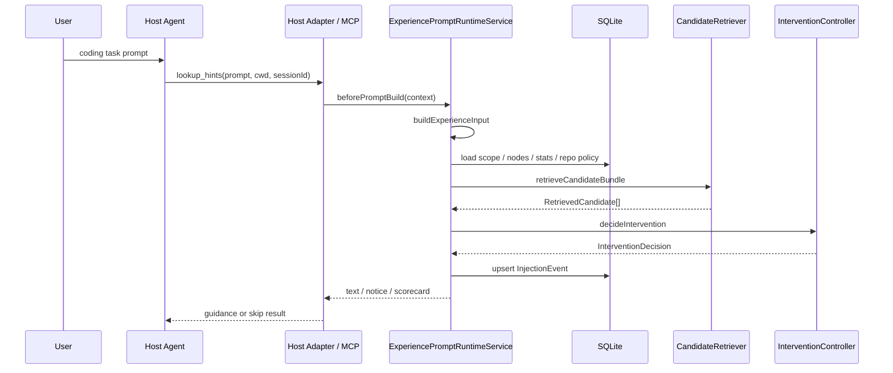

### 15.2 Tool result recording

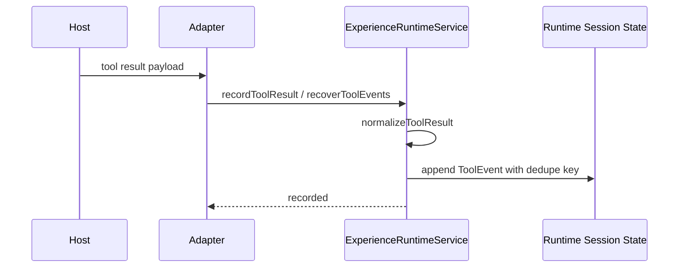

### 15.3 Task finalization / learning

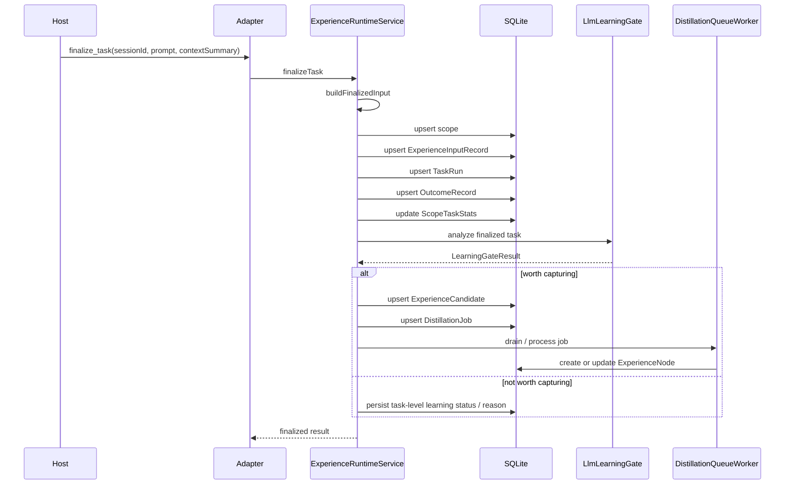

### 15.4 Feedback / governance

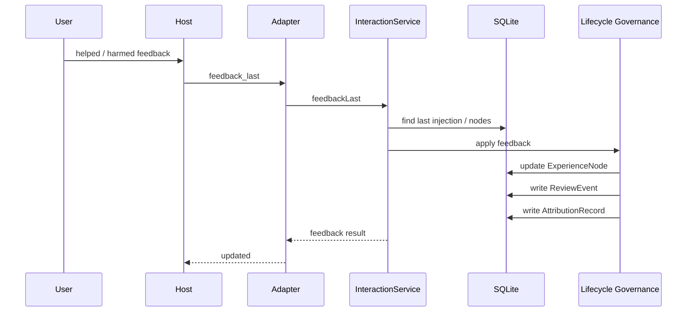

---

## 16. 当前对象关系总览

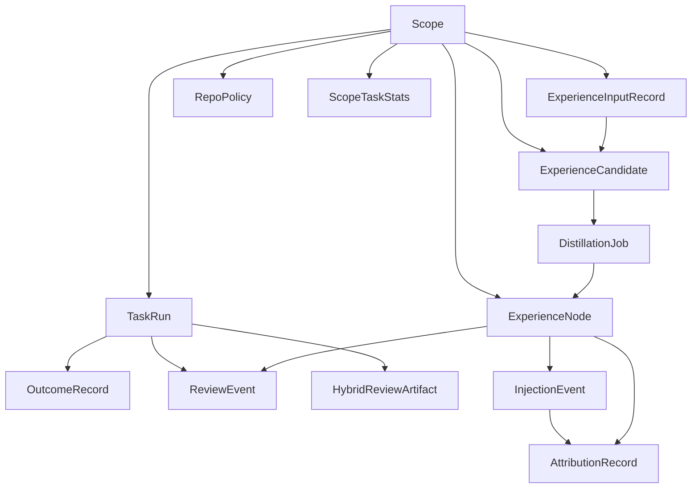

---

## 17. 当前代码阅读顺序

如果只想理解现有架构，可以按以下顺序阅读：

```text
1. README.md
2. docs/development/experience-model.md
3. src/types/domain.ts
4. src/store/sqlite/schema.sql
5. src/adapters/codex/mcp-server.ts
6. src/runtime/prompt-service.ts
7. src/runtime/service.ts
8. src/input/input-adapter.ts
9. src/analyzer/candidate-signals.ts
10. src/analyzer/llm-learning-gate.ts
11. src/controller/candidate-retriever.ts
12. src/controller/intervention-controller.ts
13. src/experience-management/node-lifecycle-governance.ts
14. src/feedback/state-transition.ts
15. src/interaction/service.ts
16. src/cli/dispatch.ts
```

---

## 18. 当前架构中的关键边界

### 18.1 Adapter 与 Runtime

```text
Adapter 负责宿主接入。
Runtime 负责 ExperienceEngine 内部任务流程。
```

### 18.2 Prompt Runtime 与 Task Runtime

```text
Prompt Runtime 负责任务开始前的经验检索与注入。
Task Runtime 负责工具事件记录、任务结束、学习与后处理。
```

### 18.3 Task Record 与 Experience Node

```text
Task Record 保存任务历史。
Experience Node 保存可检索、可注入、可治理的经验。
```

### 18.4 Candidate 与 Node

```text
ExperienceCandidate 是学习候选。
ExperienceNode 是最终进入检索与治理系统的经验节点。
```

### 18.5 Retrieval 与 Intervention

```text
Retrieval 负责找到相关节点。
Intervention 负责决定 skip / inject_conservative / inject。
```

### 18.6 Feedback 与 Governance

```text
Feedback / Attribution 记录一次干预的结果。
Governance 根据结果更新节点状态和投放状态。
```

---

## 19. 当前架构摘要

ExperienceEngine 当前架构可以压缩成下面这张图：

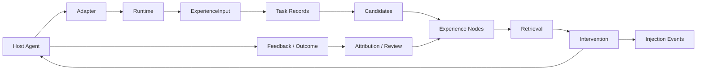

对应一句话：

```text
Host agent 产生任务与工具信号；
Runtime 将信号变成 ExperienceInput 和任务记录；
Learning pipeline 将部分任务记录变成 candidate 和 node；
Retrieval / Intervention 在后续任务中查找并注入 node；
Feedback / Governance 根据结果更新 node 的状态。
```
